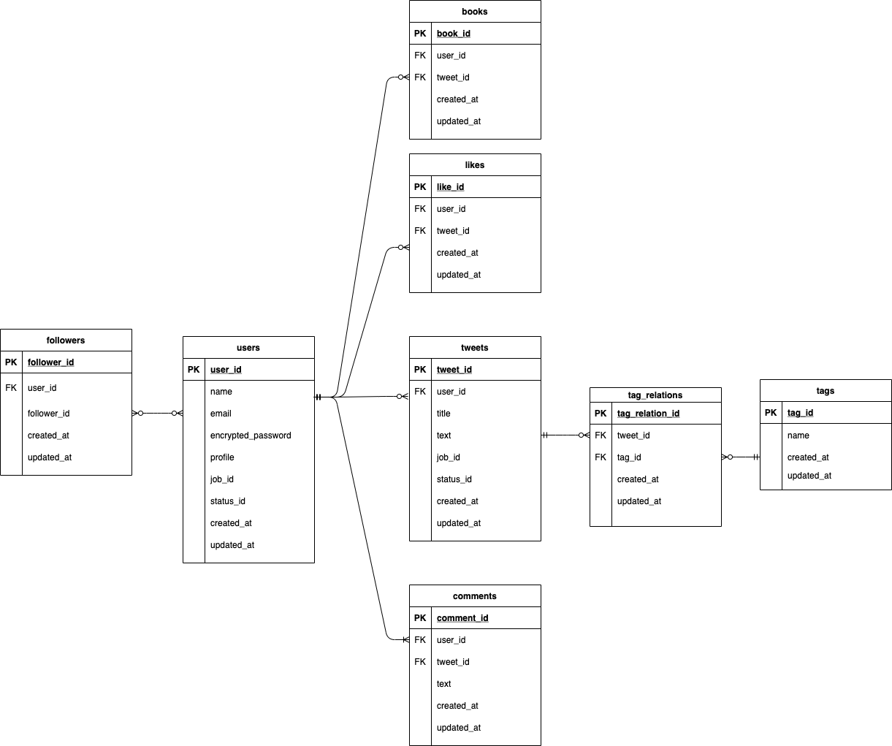

# Motivate

## アプリ概要

数ある作品の中からご覧いただきありがとうございます。
各職業の方がもっと仕事の質を上げたい、あるマイナスの状態の方がその状態を改善したいと思うような目的意識を与えるドラマ、映画、アニメ、漫画、個人動画などを投稿、もしくは探せるサービスです。

サイトURL <a href="https://motivate-app.com/">Motivate</a>(ログイン画面からゲストログインボタンで簡単ログインができます。)

## 使用技術一覧

### フロントエンド

- HTML/CSS
- sass
- JavaScript

### バックエンド

- Ruby(2.6.5)
- Rails(6.0.3.6)
- MySQL(5.6.51)

### インフラ

- AWS(VPC/EC2/RDS/ALB/S3/CloudFront/ACM/Route53/IAM)
- Nginx
- Unicorn
- CircleCI
- Capistrano

### 開発環境

- VScode
- Docker/docker-compose

### テスト、静的コード解析

- RSpec
- Rubocop

### バージョン管理

- Git/GitHub

### 開発中意識した点

githubでissues、プルリクを活用し、擬似チーム開発を意識した点。

## Motivateの開発背景

自分はコロナの影響で親の収入が当時０になりました。元々大学の学費の支払いがギリギリだったのですが心配をかけまいと自分には親から告げられておらず、いきなり学費が間に合わず除籍になるかもしれないと告げられ自分の貯金を慌てて振込もうとしましたが、大学側からは明日進級会議のため今振り込んでも間に合うかわからず、最悪振り込まれたお金も返却できなくなるからやめてくれと伝えられました。再度翌年の夏に入学金を振り込めば審査次第で入学できるがその場合１年生からやり直しということも伝えられました。その日はこれからどうしていいのかもわからずお先真っ暗でした。しかし、サッカー選手の本田圭佑さんのとある動画を視聴して自分にない考えに衝撃を受けました。それは本田さんがACミランというサッカークラブに所属していた当初期待されていたような活躍ができず、ボールを持っただけで味方であるはずのファンからブーイングを受けていた当時のインタービューの動画でした。その動画で本田さんは「人が体験したことのないぐらいの谷を経験した人だけが高い山に登れる。苦しいことを経験しているのはラッキー、これをみすみす避けるようにしてはいけない。」という発言をしていました。数分の動画ですが、自分の置かれている状況を全く別の見方で見れるようにしてくれました。周りでもコロナ関係で人生が大きく変わった人がおり、同じ動画を勧めたところかなり響いていたようで本人もsnsにて広めていました。それを見てその人その人にあった人生を変えられる作品を既存のsnsやサイトよりピンポイントで探せる機能があれば、より多くの人が悪い状況を乗り越えられる、もしくは現在の状況をさらにいい方向に向かうためのモチベーションになりえるのではと思い当アプリケーションの政策を決めました。

### 機能一覧

### インフラ構成図

### ER図

