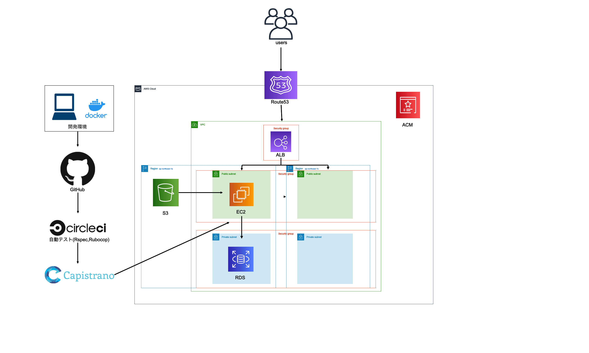
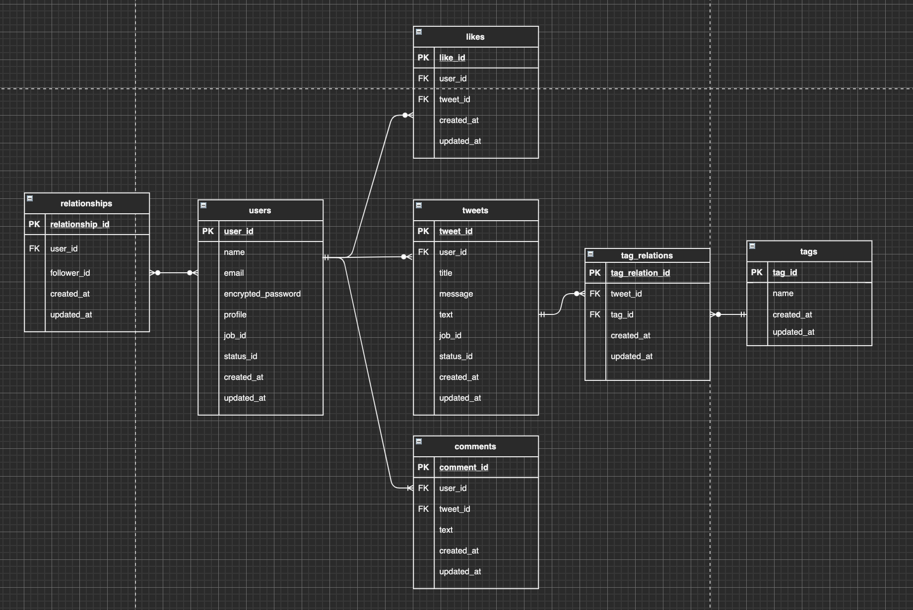

# Motivate

## アプリ概要

数ある作品の中からご覧いただきありがとうございます。
落ち込んでいる人、何かで上手くいかない人に"どん底の状況から立ち直りたい"、"努力して改善したい"といった目的意識を与える映像作品、書籍を共有するサービスです。

サイトURL <a href="https://motivate-app.com/">Motivate</a>(ログイン画面からゲストログインボタンで簡単ログインができます)

## 使用技術一覧

### フロントエンド

- HTML/CSS
- Sass
- JavaScript

### バックエンド

- Ruby(2.6.5)
- Rails(6.0.3.6)
- MySQL(5.6.51)

### インフラ

- AWS(VPC/EC2/RDS/ALB/S3/ACM/Route53/IAM)
- Nginx
- Unicorn
- CircleCI
- Capistrano

### 開発環境

- VScode
- Docker/Docker-Compose

### テスト、静的コード解析

- RSpec
- Rubocop

### バージョン管理

- Git/GitHub

## 開発でこだわった点

### 1.アプリで最も重視している目的に合わせた機能、UI,UXの実装
本アプリが最も重視しているのはユーザーが求めている作品に出会える事です。
その確率を少しでも上げるため、
1.登録時に最も解決したい心境、自身の職,状況の登録
2.1で登録した内容を元におすすめを表示する機能
3.4種類の検索方法
3.あらゆるランキングの表示
などを導入し、UI,UXも検索、ランキング部分を見つけやすくするためトップページにサイドバーとして表示しました。また、トップページの各投稿には長くなる可能性のある説明文の部分は表示せず、代わりにユーザーを惹きつける一言を表示する事で
短時間で興味の惹かれる投稿を探せる仕様にしました。

### 2.使いやすいUI,UX
ネットにあまり不慣れな方でも直感的に使えるよう、ホバー時の透明度の変化、拡大、各ボタンを立体的なデザインへの変更、またスマホやタブレットであろうと使いやすよう入りきらなくなったサイドバーを画面遷移なしで左右からスライドで現れるような実装、メニューをハンバーガーメニューにするのではなくフッターに文字なしのアイコンのみで表示し、ハンバーガーメニューを表示する１動作を減らすなどの工夫をしました。

### 3.実際の開発を意識した開発
GitHubにてissueの立ち上げや、ブランチ、プルリクエスト、マージ、issueのクローズなど、実際の工程を意識した開発手順を行い、また、開発環境で多くの企業様で導入されているDocker,CircleCI,AWSを使用した開発を行いました。

## Motivateの開発背景

等アプリの制作を決めたのは、ある動画を見て現状への考え方が変わり、前に進めた自身の体験を周りの人にも起こせるサービスを作りたいと考えたからです。 
ある動画というのは大学除籍が決まり、落胆していた時に見つけました。
内容は、サッカー選手の本田圭佑さんが所属クラブのサポーターからブーイングを受けていた頃のインタービューでした。本田さんは動画内で「人が体験したことのないぐらいの谷を経験した人だけが高い山に登れる。苦しいことを経験しているのはラッキー、これをみすみす避けるようにしてはいけない。」と発言していました。 
その一言で除籍され、金銭に余裕もない現状への考え方が180度変わりました。 
この出来事を偶然ではなく高確率で引き起し、自分と同じように予期せぬ自体で立ち止まってしまった方に前に進んで欲しいと考え、当アプリの作成を決めました。

## 機能一覧

### ユーザー機能
- 新規登録、ログイン（永続ログイン）、ログアウト
- マイページ編集
- ゲストログイン機能

### 投稿関連の機能
- 投稿、編集、削除機能
- 投稿詳細機能（モーダル)
- 自身の投稿一覧

### いいね機能(非同期通信)
- 投稿にいいねできる機能
- いいね数表示機能
- 自身がいいねして投稿の一覧

### タグ関連の機能(非同期通信)
- 投稿に複数タグをつけられる機能
- タグの一覧
- タグを検索する機能
- タグをクリックするとそのタグのついて投稿一覧になる機能

### 検索関連の機能(非同期通信)(レスポンシブ時、左からサイドバーとして出るようにしています。)
- キーワード検索
- 職業を選択することでその職業の方におすすめの投稿が検索できる機能
- 心境を選択することでその心境の方におすすめの投稿が検索できる機能

### フォロー機能(非同期通信)
- フォロー、フォロー解除機能
- フォロー、フォロワー一覧表示機能

### コメント機能(非同期通信)
- 投稿にコメントをする機能
- コメントの一覧機能
- コメントを削除する機能

### おすすめ機能
- ユーザー登録時に選んだ心境に合わせておすすめ投稿５つが表示される機能
- おすすめ5つが自動スライドする機能

### ランキング機能(レスポンシブ時、右からサイドバーとして出るようにしています。)
- いいね数の多い順の投稿ランキング
- 最もおすすめに選択されている職のランキング
- 最もおすすめに選択されている心境のランキング

### その他機能
- 画面最上部へ移動する機能
- フラッシュメッセージのフェイドアウト機能
- レスポンシブ表示時、サイドバー部分を左右からjsで出し入れ自由にする機能
- 完全レスポンシブ対応

## インフラ構成図

## ER図

## 今後の改善点
- Vue.jsによる部分SPA化
- ユーザー間が関われる機能の導入
- YouTubeの外部APIの導入
